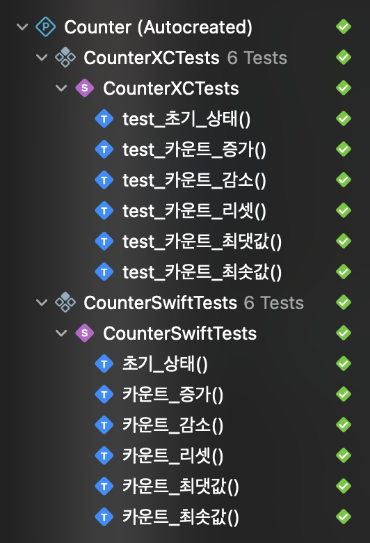
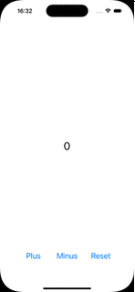

# Counter

숫자를 카운팅할 수 있는 간단한 iOS 앱

## ✨ 기능

1. 숫자 증가: "Plus" 버튼 클릭 시 숫자 증가
2. 숫자 감소: "Minus" 버튼 클릭 시 숫자 감소
3. 초기화 기능: "Reset" 버튼 클릭 시 숫자 0으로 초기화
4. 현재 숫자 표시: 중앙에 현재 숫자 표시

## ✅ 요구사항

1. UI 구성

    * UILabel: 화면 중앙에 현재 숫자 표시
    * UIButton: 하단에 +, -, Reset 버튼 수평으로 배치
        * 각각 증가, 감소, 초기화 기능 담당

2. Auto Layout

    * 모든 컴포넌트는 Auto Layout을 통해 배치

3. 최대/최소 값 설정

    * 증가/감소 값이 특정 범위를 벗어나지 않도록 제한(예: -10 <= count <= 10)
    * 최솟값일 때 - 버튼 비활성화, 최댓값일 때 + 버튼 비활성화

## 🛠️ 기술 스택

UIKit, MVVM, SnapKit, Combine, XCTest, Swift Testing

## 🚀 실행 방법

1. 프로젝트 클론

```bash
git clone https://github.com/youseokhwan/nbcamp-precamp-projects
cd nbcamp-precamp-projects/Counter
open Counter.xcodeproj
```

2. 시뮬레이터 혹은 실제 디바이스에서 앱 실행(⌘ + R)

## 🐢 테스트 결과

테스트는 MainViewModel을 대상으로 유닛 테스트만 구현.
XCTest와 Swift Testing은 같은 TC를 가지고 있으나, 학습 목적으로 중복해서 구현.



## 🔥 구현 결과

|기능|결과|
|:---:|:---:|
|카운트 증감||
|카운트 초기화||
|최솟값 제한||
|최댓값 제한||
