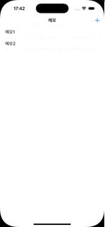
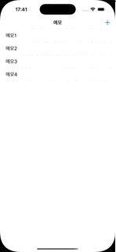

# Memo

메모를 추가, 삭제 할 수 있는 간단한 리스트 앱

## ✨ 기능

1. 메모 추가: + 버튼을 눌러 메모 추가
2. 메모 삭제: 특정 메모를 스와이프하여 삭제
3. 데이터 저장: UserDefaults 활용해 데이터 저장 및 불러오기

## ✅ 요구사항

* UITableView: 메모 리스트 표시
* UIButton(Navigation Bar): 우상단에 + 버튼 추가하여 새로운 메모 입력받기
* UIAlertController: + 버튼 눌렀을 때 나타나는 텍스트 입력 팝업

## 🛠️ 기술 스택

UIKit, SnapKit

## 🚀 실행 방법

1. 프로젝트 클론

```bash
git clone https://github.com/youseokhwan/nbcamp-precamp-projects
cd nbcamp-precamp-projects/Memo
open Memo.xcodeproj
```

2. 시뮬레이터 혹은 실제 디바이스에서 앱 실행(⌘ + R)

## 🔥 구현 결과

|기능|결과|
|:---:|:---:|
|메모 추가||
|메모 삭제||
|데이터 저장||
