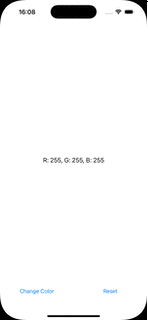
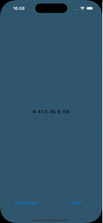

# RandomColor

버튼을 클릭할 때마다 배경색이 랜덤하게 바뀌고, 현재 배경색의 RGB 값을 화면에 표시하는 iOS 앱

## ✨ 기능

1. 랜덤 색상 생성: 버튼 클릭 시 배경색을 랜덤하게 변경
2. 색상 정보 표시: 배경색의 RGB 값을 화면에 표시
3. 초기화 기능: 초기화 버튼을 누르면 배경색이 흰색으로 변경되고, RGB 값도 초기화

## ✅ 요구사항

### 1. UI 구성

* UIView: 화면 전체를 덮는 영역
* UILabel: 중앙에 RGB 값을 표시
* UIButton: 화면 하단에 두 개의 버튼 배치
    * "Change Color" 버튼: 랜덤 색상 변경
    * "Reset" 버튼: 초기화

### 2. Auto Layout

모든 컴포넌트가 Auto Layout을 통해 화면에 적절히 배치되어야 함

## 🔥 구현 결과

|기능|결과|
|:---:|:---:|
|랜덤 색상 변경||
|초기화||

